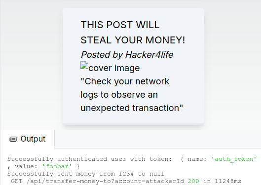

# CSRF vulnerability with an image

The core idea of Cross-Site Request Forgery, aka CSRF,
is to force a user into sending an authenticated request to a certain URL.

This is what we mean by "forging" a request: 
artificially creating an HTTP request with certain properties, 
in order to lead an attack.

## Example: triggering a money transfer

The attacker may want to force the victim
into sending a request to `api/transfer-money-to?account="attackerId"`.
As you can guess from the URL, 
this will transfer some money from the victim's account 
to the attacker's bank account.

In this demo, the attacker misuses a forum system.
They post an image whose URL is not an actual image, 
but the URL of the money transfer API.

When this "image" is displayed to the victim, 
they get their money stolen. 
Technically, it's the victim's browser that sends the request,
that's why it passes the authentication check!

You can observe that in the server logs in the following screenshot:

## A more elaborate cross-site scenario

This demo is the most basic type of CSRF vulnerability you can think of. 
We could fix the vulnerability by using a POST method for the `transfer-money-to`
API endpoint, instead of GET.

But that's not enough for more elaborate CSRF attacks. 
Let's describe a more realistic attack scenario.

The attacker creates a pirate website,
different from your own website,
which automatically fires an authenticated request to your website 
when the victim connects to it. 

This is difficult to achieve, 
but possible if your authentication cookies are not properly configured,
or the attacker somehow gets control of subdomains of your main domain.
For example, they deploy a website on `pirate.yourwebsite.com`.

This is what "cross-site" means in CSRF:
the forged request is usually fired from a separate pirate website.

# A possible fix: the CSRF token

One solution is to use a specific token that is only ever available on your own website,
so you can tell that the request comes from your application and not an attacker's website.

We call this token a "CSRF token".

There are other complementary mechanisms to prevent CSRF attacks, 
you'll find more information in the resources section below.

## 🔨 Practice: anti-CSRF measures

import SkipPractice from "@/components/SkipPractice.mdx"

<SkipPractice />

In the interactive demo :

1) Make `transfer-money-to` a POST endpoint

This is not enough to prevent more elaborate cross-site request forgery 
where an attacker forces the submission of a form with the POST method.

2) In `middleware.ts`, change the `sameSite` attribute of the `auth_token` cookie to "strict",
or at least "lax".

This will prevent a pirate website to fire authenticated requests with cookies to your own API.

3) In `middleware.ts`, generate a CSRF token. 
You can use the [kubetail-org/edge-csrf package.](https://github.com/kubetail-org/edge-csrf).

You can observe the CSRF token cookie in the "application" tab of your browser's developer tools.

IMG TODO

## References

[OWASP Top 10 - Broken Access Control](https://owasp.org/Top10/A01_2021-Broken_Access_Control/). 
CSRF is mentioned as a kind of broken access control vulnerability.

[Understanding CSRF attacks, Vercel](https://vercel.com/blog/understanding-csrf-attacks). Our demo is strongly inspired from this excellent article.

[Understanding the SameSite cookie attribute, Vercel](https://vercel.com/blog/understanding-the-samesite-cookie-attribute)

[Edge CSRF, for generating CSRF tokens in edge middlewares](https://github.com/kubetail-org/edge-csrf)

[Securing Server-Rendered Applications – Next.js Case](https://gitnation.com/contents/securing-server-rendered-applications-nextjs-case)

import BetaBanner from "@/components/BetaBanner.mdx"

<BetaBanner />

import ReactAdvancedBanner from "@/components/ReactAdvancedBanner.mdx"

<ReactAdvancedBanner />